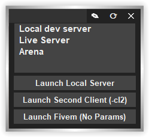

# fivem-launcher
Stupid simple python app to auto launch fivem with specific params. 

Made to help dev workflow & stop annoying relaunches if you play on multiple servers

## Features

- Auto launch with pure mode
- Auto launch with specific FiveM build
- Auto-connects to server (Sometimes, I swear this doesn't work most of the time)
- **Benefits:** Stops annoying fivem relaunch

### Devs & CL2
- Set your Fxserver.exe in the config
    - This adds "Launch Server" button in the UI
- Set your dev server with type: "dev"
    - Does not support multiple dev servers, only have one type "dev" configured.
- Enable cl2 config option
    - This adds cl2 launch button in the UI, which will launch cl2 with required params

## How
1. Launch app
2. Click `Edit` button
3. Add servers and required info
4. Click `Refresh` button
5. Click server in the list. Enjoy.

## Config
- Just do it in the application UI. It auto opens your default text editor.
    - But, it's located at `%APPDATA%/houseoffun/fivem_launcher/config.json`

# Preview (Simple, Stupid, and Ugly)

